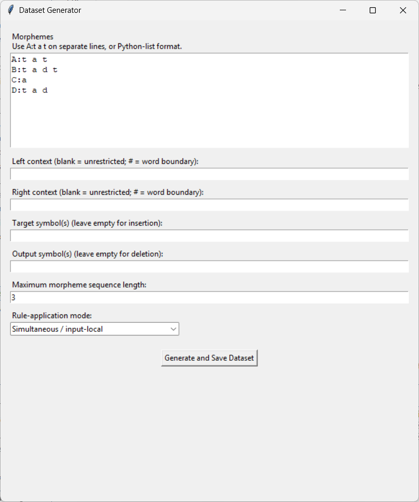
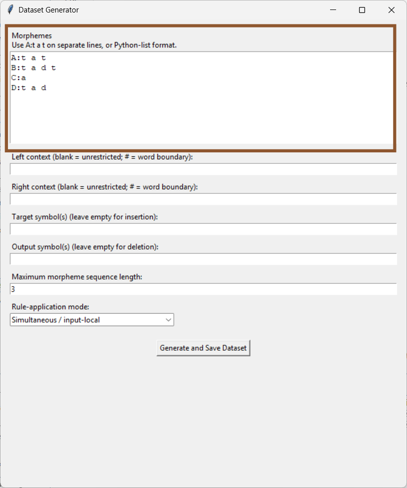
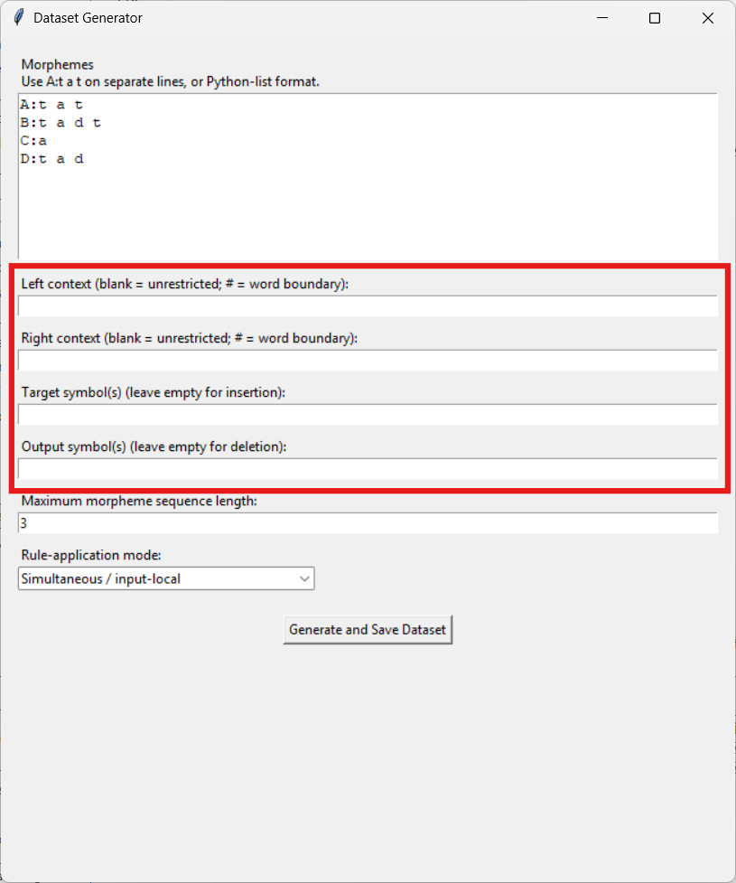
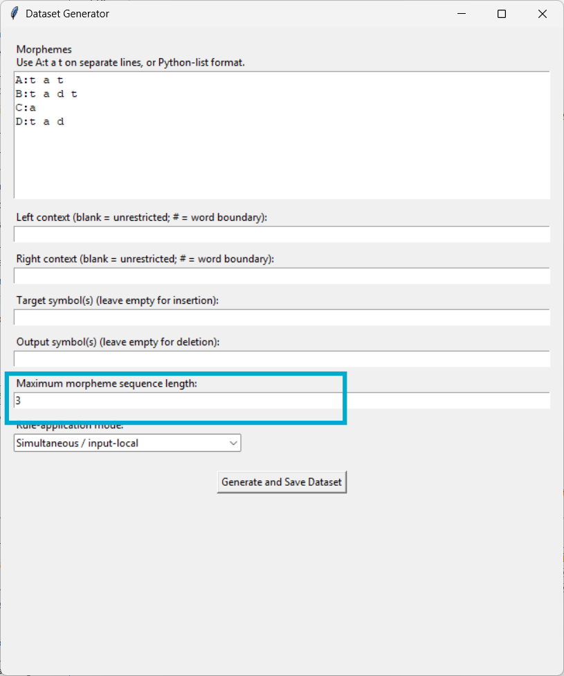
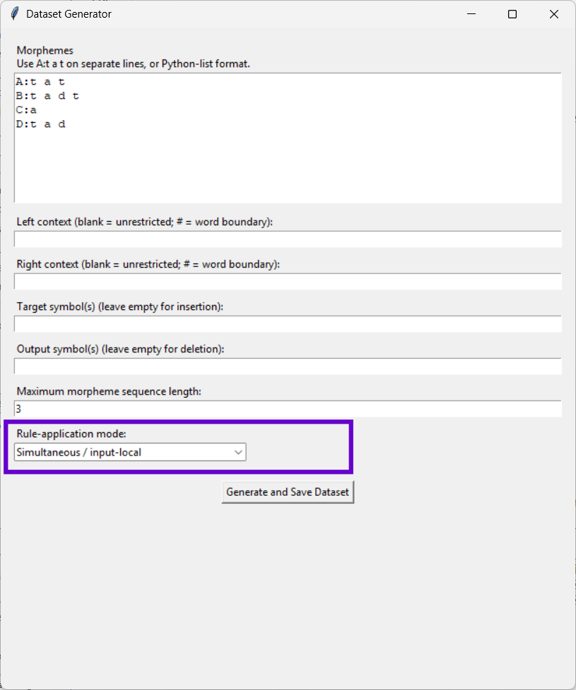
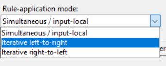
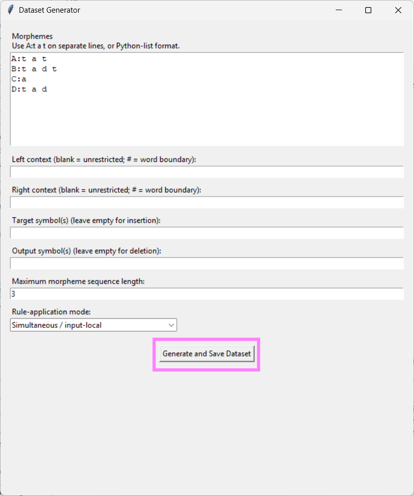

# How to use the dataset generator

Once you’re in the data folder, type the command ```python dataset-generator.py``` in the terminal and then hit enter.

This window should pop up:




### Entering Morphemes
The first part of using the dataset generator is entering the morphemes. As you can see here, highlighted by the brown box, there is a textbox for this that is automatically populated with an example set of morphemes.



Here, there are two main ways you can enter the data:
1. As shown on in the autopopulated example, with each line written as `morpheme_name:phonemes`. For example:
```
A:t a t
B:t a d t
C:a
D:t a d
```
2. As a Python-list written as `[('morpheme1_name', 'morpheme1_phonemes'), ('morpheme2_name', 'morpheme2_phonemes')]`.  For example: 
```
[('A', 't a t'), ('B', 't a d t'), ('C', 'a'), ('D', 't a d'), ('E', 't')]
```

It does not matter which format you use, as long as you use it correctly. Something to keep in mind is that each phoneme in a morpheme should be space-separated (e.g. 't a t' is not processed the same as 'tat').

### Entering Contexts, Target and Output
The next part is determining the rule you want the generator to apply.




If you want to find a specific phoneme/symbol(s), this is your target symbol. If you want to find it only in next to or between particular phonemes/symbols, these are your left context and right context. If you want to replace the target symbol in that context with something, what you want to replace the target with is your output symbol.

Generally, these will just be symbols representing phonemes, like in the following simple example:
```
Given the autopopulated example morphemes, say our word is morphemes DCB, which ends up being 't a d a t a d t' underlyingly. This is an example I will continue to use below.

If we're applying the rule that a 't' becomes a 'd' between 'a' and another 'a', the right context is 'a' and the left context is 'a', the target is 't' and the output is 'd'.
    /t/ → [d] / /a/_/a/

The surface form for CDC should in this case be 't a d a d a d t'.
```

If you want to forgo limiting one or both of the right and left contexts, simply leave that box empty. 

If you want the target to only be found in the context of the *beginning* of a word, make the left context `#`. If you want the target to only be found in the context of the *end* of a word, make the right context `#`.

Finally, if you want to delete the target symbol (e.g. `/t/ → ∅ / _ /a/`), leave the output symbol box empty. 

Here are some examples applying these principles, given that each of these are being applied to the underlying form 't a d a t a d t':
| Left context | Right Context | Target symbol(s)  | Output Symbol(s)| Surface form   |
| :----------: |:-------------:| :----------------:|:---------------:|:--------------:|
|              |        a      |        t          |        d        | d a d a d a d t|
|       #      |               |        t          |        d        | d a d a t a d t|
|              |       #       |        t          |        d        | t a d a t a d d|
|              |               |        t          |        d        | d a d a d a d d|
|              |       a       |        t          |                 | a d a a d t    |


### Maximum Morpheme Sequence Length





This setting allows you to change the maximum number of morphemes in a generated sequence.

If this is set to 1 with the autopopulated morphemes and the rule described above, for example, the generator would generate these four lines:
```
t a t,A
t a d t,B
a,C
t a d,D
```
In the same context but with the maximum morpheme sequence length set to 2, the generator would generate those length-1 examples as well as the sixteen length-2 combinations.

```
t a t,A
t a d t,B
a,C
t a d,D
t a t t a t,A A
t a t t a d t,A B
t a d a,A C
t a t t a d,A D
t a d t t a t,B A
t a d t t a d t,B B
t a d t a,B C
t a d t t a d,B D
a d a t,C A
a d a d t,C B
a a,C C
a d a d,C D
t a d t a t,D A
t a d t a d t,D B
t a d a,D C
t a d t a d,D D
```
If you enter 3 it will generate all the length-1 lines and all the length-2 lines as well as the length-3 combinations. Setting this to 4 would add all length-4 combinations, and so on.

### Rule-Application Mode





### Generate and Save

Next, hit the button highlighted below.



This will open the file explorer, where you can name the file where the dataset will be saved, and choose where. You can move or rename it later if necessary.