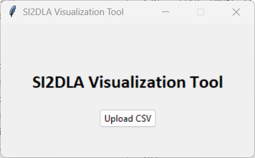
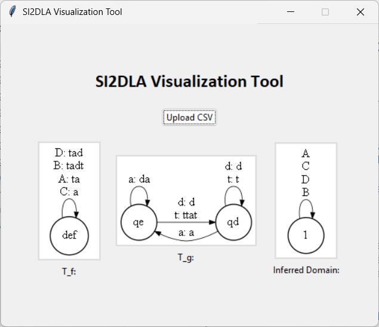

# How to use the si2dla code

For running the version of si2dla that produces graphics, si2dla_gui.py file is currently located in the dom_innf_si2dla_gui folder. You can `cd` into that folder (`cd .\dom_inf_si2dla_gui\`) in the terminal, then run `python si2dla_gui.py`. 

When this window (above) pops up, press the 'Upload CSV' button. Select the data file from the file explorer that opens.

